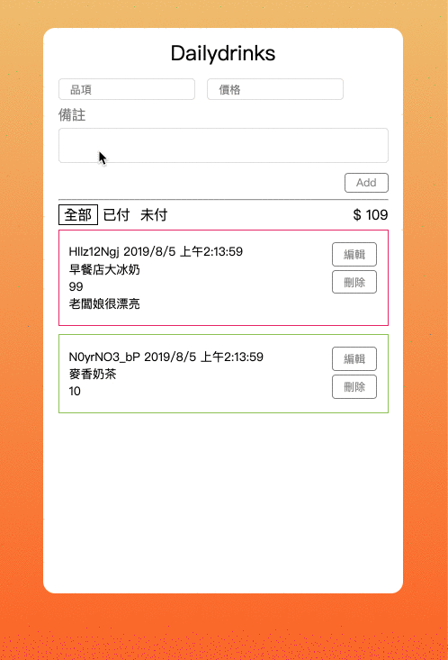

# dailydrinks



- [x]  Homepage is a list to list all the `orders`
- [x]  Each `order` contains the following fields:
    1. A single-line text of it's `name`
    2. The number `price` of the order
    3. A multi-line **optional** text to specify additional `notes`
- [x]  One can **add** a new order to the list by filling out a form somewhere in your app
- [x]  One can **delete** any order in the list
- [x]  One can also **edit** any order in the list


## How to start

```
npm i
npm run dev
```

## Features

- Toggle payment status - just double click the list item.
- Filter payment status

## TODO and enchancement

- Add validation for form.(required and number).
- Id should replace by name(Add field for name).
- Add amount for a single order.
